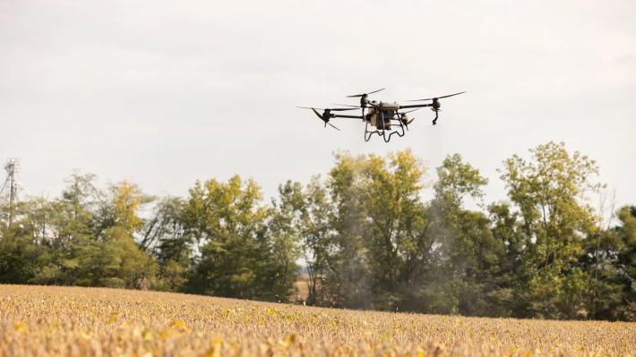
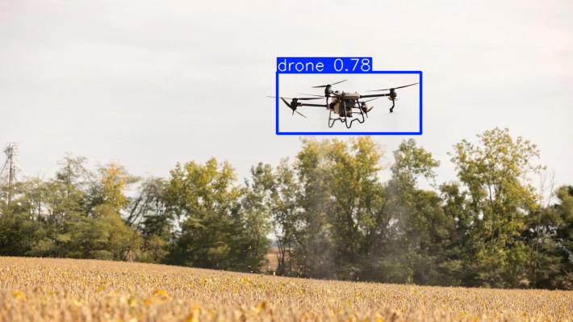
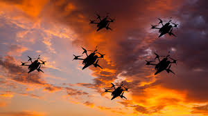
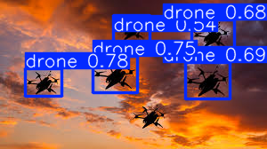

# Drone-Detection---YOLOv5

### Overview
A deep learning–based drone detection system built with YOLOv5, trained on a custom dataset to accurately identify drones in diverse environments and enable real-time monitoring for enhanced security and threat prevention.

**Using YOLOv5 small model for latency**  

### Tech Stack
`Python` | `PyTorch` | `opencv` | `YOLOv5` | `matplotlib`|

### Repository Structure
Drone Detection - YOLOV5  
    ├── inference/ → images and videos used for inference  
    ├── Model/ → model best weigths  
    ├── notebooks/ → data prep, training, and inference  
    ├── results/ → outputs, plots, or images  
    ├── drone_data.yaml → config file  
    ├── README.md  
    └── requirements.txt  

### 📊 Results
Below are sample outputs from the trained YOLOv5 model detecting drones in test images:

| Input Image | Detection Result |
|--------------|------------------|
|  |  |
|  |  |

**Final Training Metrics:**
- Precision: 0.898  
- Recall: 0.872  
- mAP@0.50: 0.933
- mAP@0.95: 0.525

### How to Run

1. **Clone the repository**

   ```bash
   git clone https://github.com/beshoyhakeem/Drone-Detection---YOLOv5.git
   cd Drone Detection - YOLOV5

2. **Install dependencies**

   ```bash
   pip install -r requirements.txt

3. **Run the inference notebook**
 
  choose what you want to predict image or video in real time or outputed labeled video  


### Future Improvments
1. **Using YOLOv8**
2. **Using YOLOv5large**
3. **Using instance segmentation**


### 👤 Author
**Beshoy Hakeem**  
[LinkedIn](https://www.linkedin.com/in/beshoy-fahmy-14a254359/)  
[GITHUB](https://github.com/beshoyhakeem)  
Email: beshoyashraf042@gmail.com  
